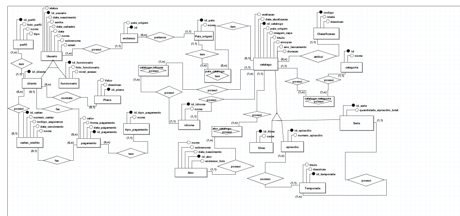
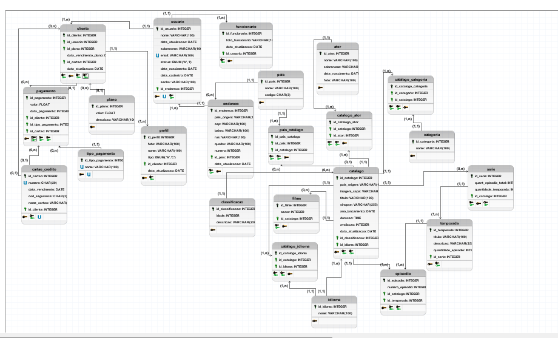

# Projeto Banco de dados

Este projeto tem o obejtivo de demonstrar o conteudo aprendido em sala de aula no curso de **DBA MYSQL**, para isto foi escolhido um modelo,um banco de dados para plataformas de streaming. Abaixo segue modelo conceitual,lógico e físico.

## Modelo Conceitual

## Modelo Logico

## Tabelas

- Tabela tb_ator
- Tabela tb_cartao_credito
- Tabela tb_catalogo
- Tabela tb_catalogo_ator
- Tabela tb_catalogo_categoria
- Tabela tb_catalogo_idioma
- Tabela tb_categoria
- Tabela tb_classificacao
- Tabela tb_cliente
- Tabela tb_endereco
- Tabela tb_episodio
- Tabela tb_filme
- Tabela tb_funcionario
- Tabela tb_idioma
- Tabela tb_pagamento
- Tabela tb_pais
- Tabela tb_pais_catalogo
- Tabela tb_perfil
- Tabela tb_plano
- Tabela tb_serie
- Tabela tb_temporada
- Tabela tb_tipo_pagamento
- Tabela tb_usuario

## Views

- **vw_ator:** Mostra de forma organizada os dados dos atores,quantidades de filmes feito por ele e quantidade de series feita por ele.

- **vw_catalogo:** Mostra de forma organizada todos os dados do catalogo, identificando series e filmes,o idioma original e quantos idiomas são possíveis escolher,a classificação indicativa e suas categorias.

- **vw_episodio:** Mostra de forma organizada todos os dados dos episódios, qual sua serie, e de qual temporada ele é. 

- **vw_pagamento:** Mostra de forma organizada todos os dados todos os dados de pagamento,seu tipo, o nome do cliente, seu plano e data de vencimento.

- **vw_perfil:** Mostra de forma organizada todos os dados do perfil e seu cliente.

- **vw_temporada:** Mostra de forma organizada todos os dados da temporada, a sua quantidade de episodios, e sua série.

- **vw_usuario:** Mostra de forma organizada todos os dados os dados de todos os usuários, deseja-se também saber quais são funcionários e quais são clientes, o endereço de cada um e seu pais de origem,  quantos perfis cada um tem e qual é o seu plano.

## Funções

- **fn_remover_acento_minusculo** Esta função realiza o cadastro de palavras sem acento. 

- **fn_valida_texto:** Esta função realiza a validação do texto e quantidade de caracteres.

- **fn_minuscula2** Esta função realiza o cadastro das palavras em minúsculo.

## Procedures

- **sp_delete_categoria:** Esta procedure faz a remoção de categorias.

- **sp_delete_idioma:** Esta procedure faz a remoção de idiomas da tabela.

- **sp_delete_pais** Essa procedure remove países da tabela.

- **sp_delete_plano** Essa procedure deleta os planos.

- **sp_delete_tipo_pagamento** Esta procedure faz a remoção de formas de pagamento, na tabela.

- **sp_delete_tipo_pagamento** Esta procedure faz a remoção de formas de pagamento, na tabela.

- **sp_insert_categoria:** Esta procedure faz a inserção validada de categorias.

- **sp_delete_tipo_pagamento** Esta procedure faz a remoção de formas de pagamento, na tabela.

- **sp_insert_idioma:** Esta procedure faz a inserção validada de idiomas.

- **sp_insert_pagamento**  Essa procedure valida e depois insere pagamentos no banco.

- **sp_insert_pais** Esta procedure faz a inserção validada de novos países na tabela.

- **sp_insert_tipo_pagamento** Esta procedure faz a inserção validada de formas de pagamento, na tabela.

- **sp_update_categoria**:** Esta procedure faz a atualização validada das categorias.

- **sp_update_idioma:** Esta procedure faz a atualização validada de idiomas na tabela.

- **sp_update_pais** Essa procedure valida e depois atualiza os países no banco.

- **sp_update_plano** Essa procedure valida e depois atualiza os planos.

## Scripts

|Scripts    |Clique aqui|
|-----------|-----------|
|DDL        |[Clique aqui](./SCRIPTS/projeto_final_criacao18-06.sql)|
|Dados      |[Clique aqui](./SCRIPTS/projetofinal_insert18-06.sql)|
|Views      |[Clique aqui](./SCRIPTS/viewsprojetofinal.18-6.sql)|
|Funções    |[Clique aqui](./SCRIPTS/functions-projeto18-06.sql)|
|Procedures |[Clique aqui](./SCRIPTS/procedures.sql)|

|Dumps      |[Clique aqui](https://seulinkaqui.com)|

## Contatos

|   
|  

